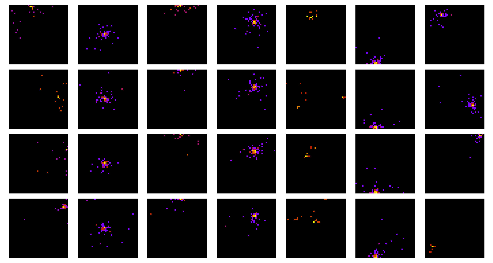

# ZDC Fast Simulation

## Overview

This repository contains code implementations for fast simulations of the Zero Degree Calorimeter (ZDC) neutron 
detector in the ALICE experiment at CERN, using state-of-the-art generative neural network architectures. 
The simulations aim to significantly reduce computation time compared to traditional Monte Carlo methods, 
employing various generative frameworks such as autoencoders, generative adversarial networks, vector 
quantization, and diffusion models.



*Example ZDC neuron detector simulations generated with GEANT software. The subsequent columns are the responses to 
different particles, while the rows show independent runs for the same particles.*

## Applied Methods

The repository contains implementations of the following generative models:

- Autoencoders:
  -  Variational Autoencoder (VAE),
  -  Autoencoders with Noise Generator,
  -  Supervised Autoencoder.
- Generative Adversarial Networks (GANs):
  -  GAN,
  -  GAN with Zero-Centered Gradient Penalty,
  -  GAN with L2 loss,
  -  GAN with Auxiliary Regressor,
  -  SDI-GAN,
  -  Wasserstein GAN (WGAN).
- Vector Quantization:
  -  VQ-VAE,
  -  VQ-GAN,
  -  Transformer as a learnable prior.
- Diffusion:
  -  DDPM with DDIM sampling.
- Normalizing Flows:
  -  MAF-style flow based on RQS functions and MADE blocks. Code available [here](https://github.com/majerzemilia/zdc-fast-simulations).   

## Repository Structure

The repository follows a structured layout to organize code modules, scripts, and utilities:

- zdc: Main directory containing the source code.
  -  architectures: Directory containing implementations of CNN, ViT, and MLP-Mixer-based encoders and decoders.
  -  layers: Directory containing custom layers and modules used in neural networks.
  -  models: Directory containing implementations of generative models.
  -  scripts: Directory containing scripts for various tasks such as hyperparameter tuning, plots, generation time.
  -  utils: Directory containing utility functions and helpers for data handling, training, and evaluation.

## Requirements

The repository was tested on an NVIDIA A100 with 40 GB memory. Ensure that your hardware setup includes a GPU with 
sufficient memory capacity for running the training and inference effectively. Additionally, make sure to install the 
specified versions of required libraries. All dependencies are listed in pyproject.toml file.

## Citation

If you use this code in your research, please cite the following work:

```latex
@article{wojnar2024fast,
  title={Fast simulation of the Zero Degree Calorimeter responses with generative neural networks},
  author={Maksymilian Wojnar and Emilia Majerz},
  year={2024}
}
```
